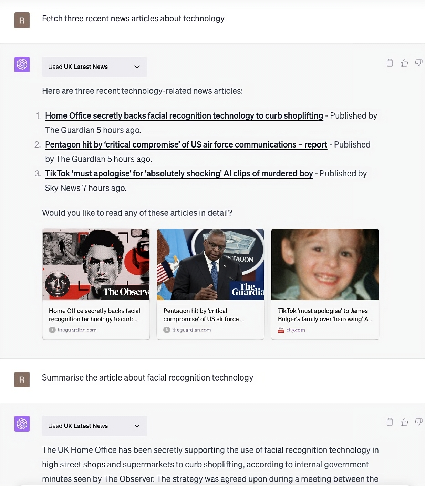

# UK Latest News ChatGPT Plugin

   

This repository hosts the 'UK Latest News' ChatGPT Plugin, a Next.js app designed to fetch and present the UK's latest news stories in ChatGPT.

You can install it via the ChatGPT Plugin Store, or read on to run it locally.



## Getting Started

The first step to get this project up and running locally is to clone the repository:

```bash
git clone https://github.com/rossheat/uk-latest-news-chatgpt-plugin.git
cd uk-latest-news-chatgpt-plugin
```

Then, create a `.env.local` file in the root directory of your project. Add the following line to the file:

```bash
SERVICE_ACCESS_TOKEN=your_token_here
```

Replace `your_token_here` with an actual service access token (a random alphanumeric string). This `SERVICE_ACCESS_TOKEN` is used by the application to verify the authenticity of incoming requests. If the token used in the request does not match the one specified in the `.env.local` file, the request will not be processed and a "401 Unauthorized" error will be returned.

Then, install the dependencies:

```bash
npm install
# or
yarn
# or
pnpm install
```

Now you can run the development server:

```bash
npm run dev
# or
yarn dev
# or
pnpm dev
```

Open [http://localhost:3000](http://localhost:3000) with your browser to see the result.

## API Overview

This project exposes the "UK Latest News" API, which offers two main operations:

- `GET /api/v1/stories`: Fetches the latest news stories from multiple UK news sources and returns an array of Open Graph-compatible data for each story.
- `GET /api/v1/story`: Given a URL, extracts the story content from the webpage.

Detailed information about the API's operations, responses, and potential errors is available in the `/public/.well-known/openapi.yaml` file.

## Learning Resources

To learn more about creating ChatGPT plugins, take a look at the following resources:

- [Chat Plugins Docs](https://platform.openai.com/docs/plugins/introduction) - learn how to make a plugin for ChatGPT.
- [Next.js Docs](https://nextjs.org/docs) - learn about Next.js features and API.

## Deployment

The easiest way to deploy the plugin is to use the [Vercel Platform](https://vercel.com/new?utm_medium=default-template&filter=next.js&utm_source=create-next-app&utm_campaign=create-next-app-readme).

Check out the [Next.js deployment documentation](https://nextjs.org/docs/deployment) for more details.
